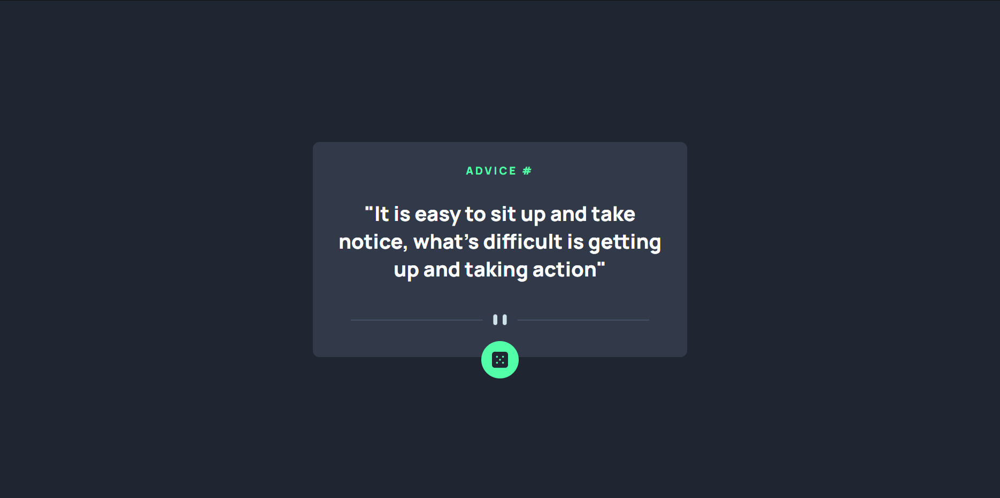

# Frontend Mentor - Advice generator app solution

This is a solution to the [Advice generator app challenge on Frontend Mentor](https://www.frontendmentor.io/challenges/advice-generator-app-QdUG-13db). Frontend Mentor challenges help you improve your coding skills by building realistic projects.

## Table of contents

- [Overview](#overview)
  - [The challenge](#the-challenge)
  - [Screenshot](#screenshot)
  - [Links](#links)
- [My process](#my-process)
  - [Built with](#built-with)
  - [What I learned](#what-i-learned)
  - [Continued development](#continued-development)
- [Author](#author)

## Overview

### The challenge

Users should be able to:

- View the optimal layout for the app depending on their device's screen size
- See hover states for all interactive elements on the page
- Generate a new piece of advice by clicking the dice icon

### Screenshot



### Links

- Solution URL: [My Solution](https://www.frontendmentor.io/solutions/advice-generator-app-using-css-flexbox-DHcxIAfP1M)
- Live Site URL: [Live Site](https://fxanz.github.io/Frontendmentor-Advice-Generator/)

## My process

### Built with

- Semantic HTML5 markup
- CSS custom properties
- Flexbox

### What I learned

Understanding about position relative and absolute

```css
.container {
  position: relative;
}

.icon {
  position: absolute;
  bottom: -10%;
}
```

### Continued development

Learn more javascript and better my css

## Author

- Frontend Mentor - [@fxanz](https://www.frontendmentor.io/profile/fxanz)
- Twitter - [@IFxanz](https://twitter.com/IFxanz)
